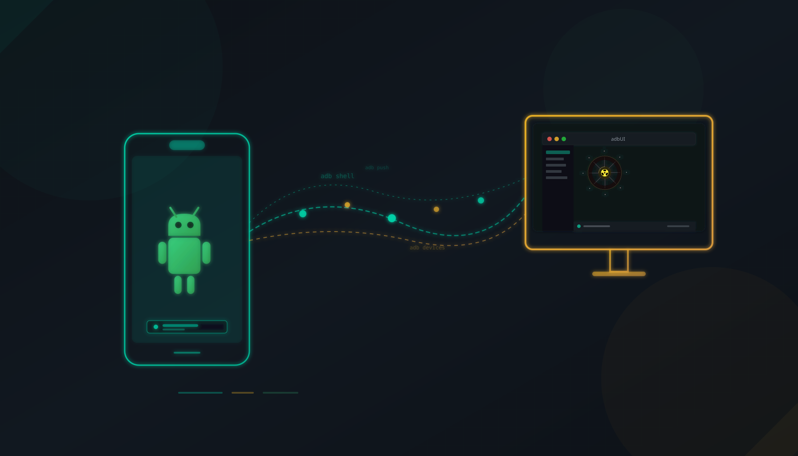
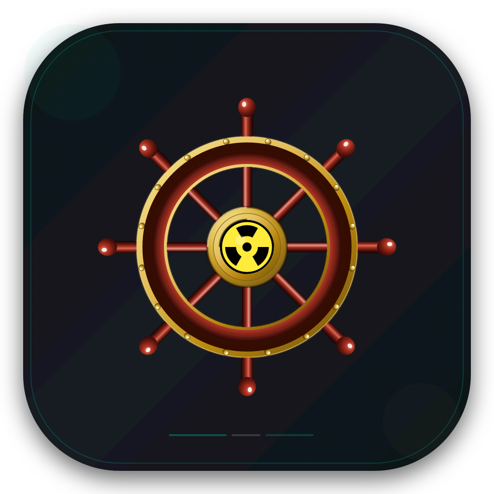

<div align="center">
  
</div>

# adbUI — Cross-Platform ADB UI Desktop App

**[中文文档](README.md) | English**

adbUI is a cross-platform ADB (Android Debug Bridge) UI desktop application built on **Tauri (Rust + Vue)**, providing a graphical interface for device management, device detail inspection, and ADB command execution — replacing tedious command-line operations.

## Features

<div align="center">
  
</div>

adbUI currently offers **12 feature modules** (11 feature pages + Settings):

- **Device Management**: Real-time device status detection via WebSocket push (auto fallback to 5-second polling when unavailable), with USB / WiFi connection type recognition. Displays brand, model, Android version, SDK version, build number, battery level, and more. Built-in wireless connection dialog (QR pairing / manual IP:port / mDNS scan) and WiFi device disconnect. Device detail panel can expand a full device info report (aggregated getprop + dumpsys) with JSON export.
- **App Management**: View all installed apps with filtering by All / User / System. Supports uninstall, force stop, clear data, freeze/unfreeze, extract APK, install APK. Batch uninstall and batch install via task framework. Automatically extracts and displays app icons (on-device dex extractor, no root needed, local disk cache). Double-click an app for details (installer, size, SDK, etc.).
- **File Manager**: Browse device file system with directory navigation and breadcrumb path. Supports uploading (push) files to device and downloading (pull) files to local machine. File type filtering (image/video/audio/document/archive/APK). Double-click image files to preview and zoom (within 10MB).
- **Log Viewer**: Real-time capture of device logcat output with filtering by log level (Verbose / Debug / Info / Warn / Error / Fatal), Tag, PID, plus text search. Supports pause and clear.
- **Shell Terminal**: Interactive ADB Shell command execution with command history, up/down arrow navigation, and error output highlighting. Built-in command library drawer (category browsing, bookmarking, custom commands) and command history drawer (search, rerun, copy, clear).
- **Screenshot & Recorder**: Device screenshot preview and local save (via system dialog, PNG format). Auto-fit zoom preview (phone frame mockup, persistent zoom toggle). Screen recording start/stop (may be restricted on Android 16+ unrooted devices due to SELinux).
- **Performance Monitor**: Real-time display of CPU usage (with history sparkline), memory used/total, device temperature. Process list showing CPU and memory usage per process.
- **Task Center**: Batch operation (batch install, batch uninstall) progress tracking and management. Real-time progress, cancel task, clear completed tasks.
- **Display Settings**: View and modify screen resolution, density (DPI), overscan parameters. Built-in common resolution/density presets. Automatic rollback on failure. Reset to factory defaults. Adjustable system parameters (animation speed, font scale, screen lock timeout).
- **Battery Management**: View real battery status. Simulate battery level, temperature, charging state. One-click restore of real battery.
- **Script Automation**: Multi-line ADB command script execution with `loop` / `end` syntax. Line-level progress display and mid-way stop. Script import/export support. Built-in input simulation (tap/long-press/swipe/keyevent/text with coordinate validation) and device reboot (normal/recovery/bootloader with confirmation dialog).
- **Settings**: Theme switching (light/dark), ADB command timeout, device polling interval, app icon cache directory configuration. Settings persisted via localStorage.

Additionally, a bottom **status bar** shows the WebSocket sync status (realtime / polling fallback), online device count with USB / WiFi statistics, running task count, and more.

## Tech Stack

- **Frontend**: Vue 3 + TypeScript + Vite 6 + PrimeVue 4 + primeicons + @tauri-apps/plugin-dialog + @tauri-apps/plugin-opener
- **Backend**: Tauri 2 (Rust) + tokio async runtime + adb_client 3.2
- **ADB Communication**: The backend ADB communication module uses the mature Rust open-source library [cocool97/adb_client](https://github.com/cocool97/adb_client) for low-level interaction, improving stability and performance.
- **Real-time Communication**: tokio-tungstenite + futures-util (WebSocket real-time device status push)
- **Wireless Connection**: qrcode + rand (QR pairing), mdns-sd (LAN mDNS device scanning)
- **Other Dependencies**: serde / serde_json (serialization), base64 (screenshot encoding), image (screenshot processing), zip (icon cache packaging)

> Note: The backend communicates with the ADB service directly via the `adb_client` library. **No separate adb command-line tool installation is required** on your machine.

## UI Design Reference

The frontend UI design references the HTML/CSS/JS prototype in the [`ref/adbUITools_html_ui_design/`](ref/adbUITools_html_ui_design/) directory. That prototype is a pure frontend static page (built-in mock data, no real device connection) used to explore the layout and interaction patterns for device management, file browsing, log viewing, Shell command execution, screenshot/recording, and performance monitoring. It is kept as a UI design reference for this project.

## Project Structure

```
├── src/                    # Frontend source (Vue 3 + TypeScript)
│   ├── components/         # Shared components (AppSidebar / AppStatusBar and per-module sub-components)
│   ├── composables/        # Composables (19 total, organized by module)
│   ├── types/              # TypeScript type definitions (mirroring Rust structs)
│   └── views/              # Page views (12 in use, plus 4 legacy files of merged modules)
├── src-tauri/              # Tauri backend (Rust)
│   └── src/
│       ├── adb/            # ADB communication module (mod.rs entry + 15 functional sub-modules, 50+ commands)
│       ├── task.rs         # Task framework (batch operation progress tracking)
│       ├── websocket.rs    # WebSocket real-time notification service (device status push)
│       └── lib.rs          # App entry and command registration
├── ref/                    # Reference prototype (UI design, read-only)
├── doc/                    # Project documentation (see documentation index below)
├── img/                    # Required project image assets
└── tmp/                    # Temporary files (not tracked by git)
```

## Documentation Index

This project provides a complete documentation system, organized by reader type:

| Reader Type | Document | Description |
|-------------|----------|-------------|
| End Users | [User Guide (Chinese)](doc/user-guide/user-guide.md) / [English](doc/user-guide/user-guide.en.md) | Installation, quick start, feature guides, FAQ |
| Human Developers | [Developer Guide (Chinese)](doc/dev-guide/human/developer-guide.md) / [English](doc/dev-guide/human/developer-guide.en.md) | Architecture, coding standards, debugging, build & release |
| AI Coding Assistants | [AI Agent Guide (Chinese)](doc/dev-guide/ai-agent/AGENTS.md) / [English](doc/dev-guide/ai-agent/AGENTS.en.md) | Project overview, command reference, code patterns, pitfalls |

For more documentation navigation, see [doc/README.md](doc/README.md).

## Development & Build

```bash
# Install dependencies
pnpm install

# Desktop development (launches Tauri window, connects to ADB service via adb_client library)
pnpm tauri dev

# Browser development (Mock mode, no adb required)
pnpm dev

# Build frontend (includes vue-tsc type checking)
pnpm build

# Build desktop app (generates deb etc. on Linux; CI produces deb / AppImage / msi / dmg per platform)
pnpm tauri build
```

## Directory Conventions

- `doc/`: Project documentation (design docs, plans, notes) — stored here
- `img/`: Required project image assets — stored here
- `tmp/`: Temporary files (screenshots, logs, debug artifacts) — always placed here and ignored by git

## License

This project is released under the [MIT License](LICENSE). Please read the [DISCLAIMER.md](DISCLAIMER.md) before using this project.

## Recommended IDE Setup

- [VS Code](https://code.visualstudio.com/) + [Vue - Official](https://marketplace.visualstudio.com/items?itemName=Vue.volar) + [Tauri](https://marketplace.visualstudio.com/items?itemName=tauri-apps.tauri-vscode) + [rust-analyzer](https://marketplace.visualstudio.com/items?itemName=rust-lang.rust-analyzer)
