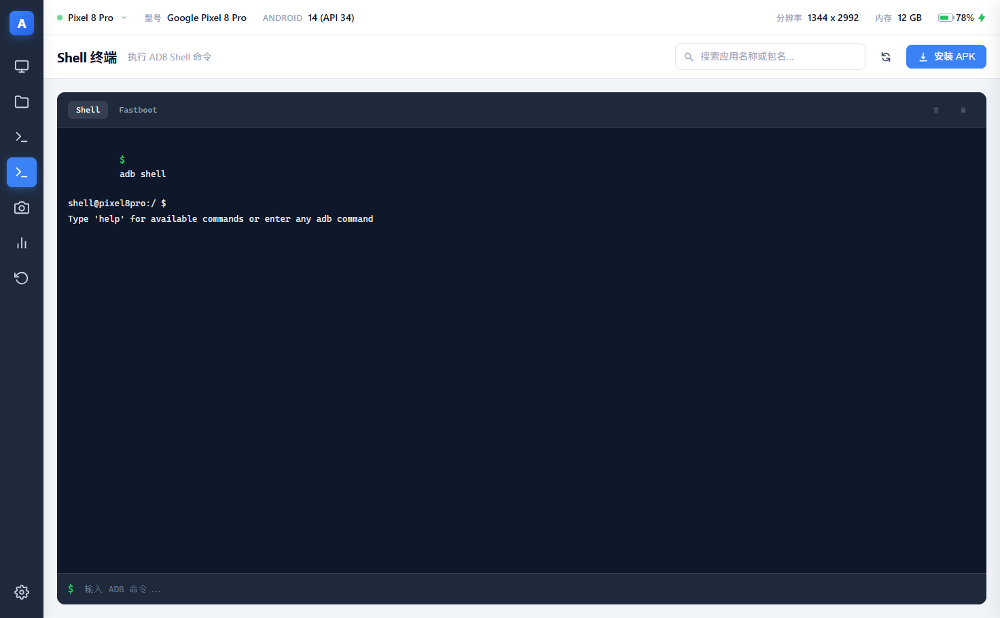
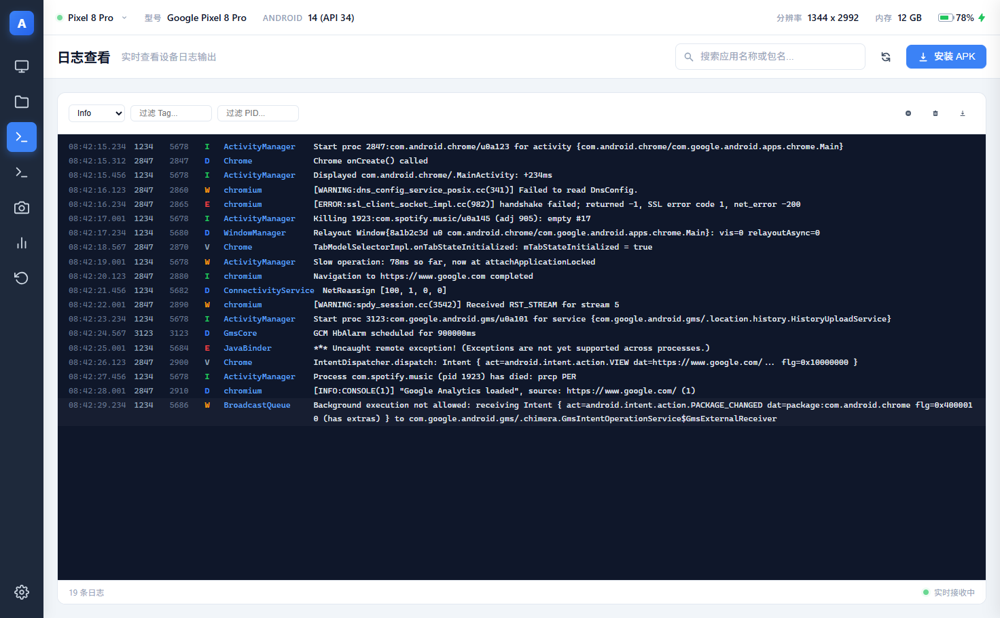
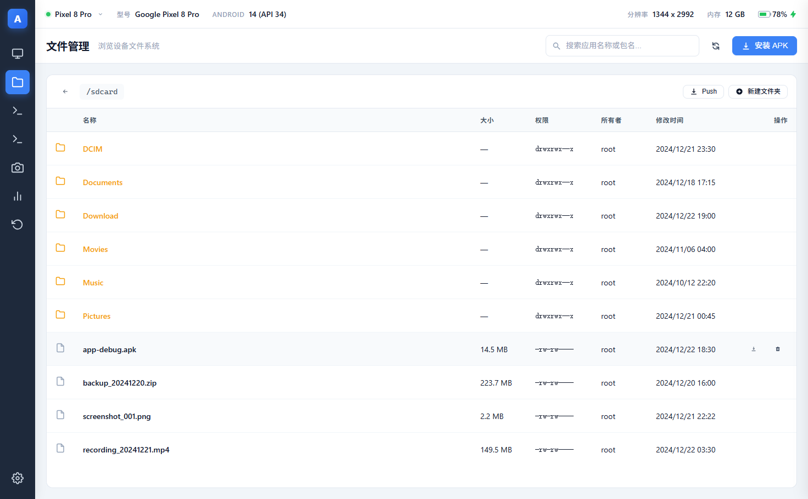
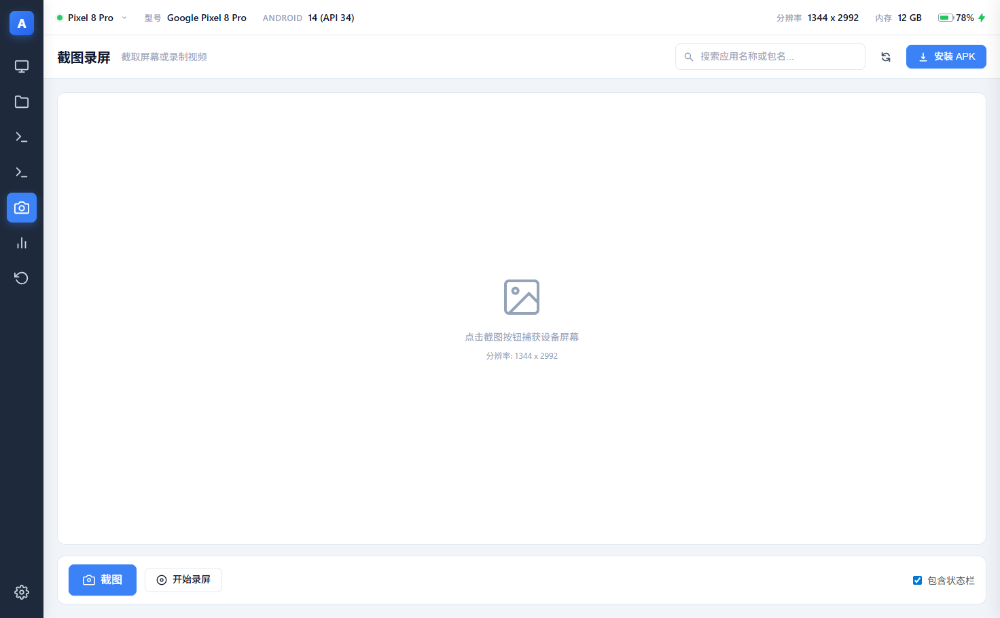
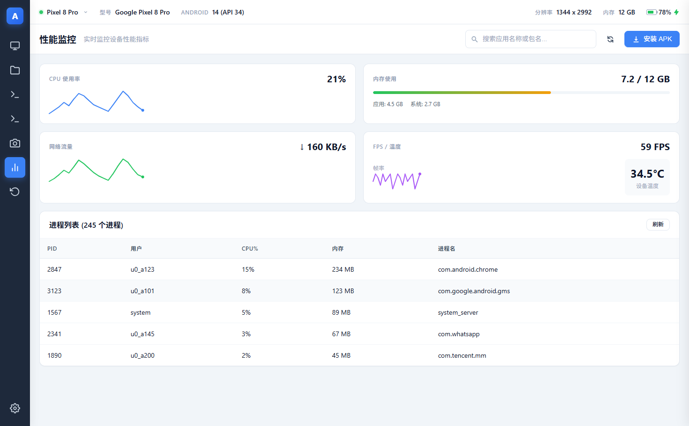
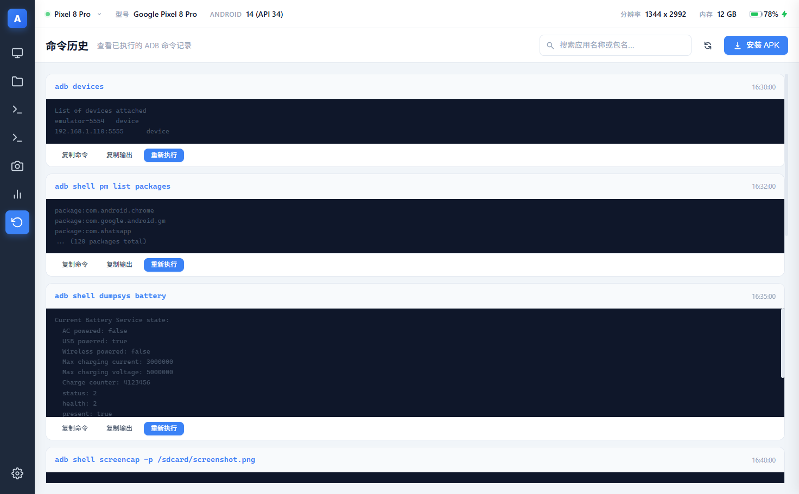

# ADB UI Tools(UI 设计探索)

> **项目定位**:本项目是**跨平台 PC 端 ADB 设备管理应用**的 **UI 前期设计探索**,并非真实可用的工具实现。所有界面均基于内置演示数据(mock)渲染,不连接真实 ADB 设备、无后端服务,仅用于验证界面方案、信息架构与交互流程,为后期真正实现的跨平台 PC 应用提供 UI 设计参考。

基于 Web 的 ADB 设备管理界面设计稿,通过浏览器可视化呈现应用管理、文件浏览、日志查看、Shell 命令执行、截图录屏与性能监控等 ADB 操作的界面布局与交互方式。

纯前端实现(HTML + CSS + JavaScript),无框架、无构建依赖、无第三方库,打开即用。

## 界面功能规划

以下功能模块均为 UI 设计稿,交互仅作用于演示数据,不产生真实设备操作:

- **应用管理** — 查看设备上安装的应用列表,搜索、排序、批量操作与 APK 安装入口
- **文件管理** — 浏览设备文件系统,展示文件属性(权限、属主、大小、修改时间)
- **日志查看器** — 实时查看设备 Logcat 日志输出,支持级别过滤与搜索
- **Shell 终端** — 内置终端,执行 ADB Shell 命令并查看输出
- **截图录屏** — 一键截取设备屏幕,或录制屏幕视频
- **性能监控** — 实时展示设备性能指标,可视化曲线呈现
- **命令历史** — 记录已执行的全部 ADB 命令,支持回看与复用
- **多设备管理** — 顶部状态栏设备下拉切换,支持无线连接(TCP/IP)入口
- **显示调节** — 分辨率 / DPI 预设与自定义、过扫描无级调节、动画速度 / 字体 / 锁屏时间调节
- **电池模拟** — 模拟电量 / 温度 / 充电状态,一键还原真实电池状态(测试向)
- **设备控制** — 重启系统 / Recovery / Bootloader / Fastboot,点击 / 滑动 / 长按 / 物理按键 / 文本输入模拟
- **自动化脚本** — 录制 / 编辑 / 执行脚本(点击、滑动、延时、循环),支持导入导出与执行中停止
- **常用命令库** — 高频 ADB 指令分类一键执行,支持收藏与自定义,与命令历史联动
- **深色主题界面** — 现代化暗色 UI,图标化侧边导航,交互友好

## 界面预览

### 设备管理

顶部状态栏展示当前设备信息,点击可下拉切换已连接的设备,并支持通过 TCP/IP 添加无线连接设备。


### Shell 终端

内置命令终端,可直接执行 `adb shell` 命令,实时查看执行结果。



### 日志查看器

实时滚动显示设备 Logcat 日志,支持按日志级别过滤与关键字搜索。



### 文件管理

以树形/列表方式浏览设备文件系统,展示文件大小、权限、属主与修改时间等属性。



### 截图录屏

截取设备屏幕画面,或录制设备屏幕视频,方便问题复现与文档记录。



### 性能监控

实时监控设备 CPU、内存等性能指标,以曲线图形式可视化展示变化趋势。



### 命令历史

完整记录会话中执行过的所有 ADB 命令,支持搜索历史、一键复用。



## 环境要求

| 依赖 | 要求 | 说明 |
| --- | --- | --- |
| 浏览器 | Chrome / Edge / Firefox 等现代浏览器 | 需支持 ES6+ 与 SVG |
| 操作系统 | Windows / macOS / Linux | 任意支持浏览器运行的平台 |

> 本设计稿无需安装 ADB 或任何其他依赖,全部数据为内置演示数据;真实 ADB 能力将在后期实现的跨平台 PC 应用中提供。

## 本地启动方式

方式一:直接双击(或拖入浏览器)打开 `src/index.html` 即可查看设计稿。

方式二:使用本地静态服务器启动(推荐,便于后续扩展):

```bash
# Python 3
cd adbUITools_html_ui_design/src
python -m http.server 8080
# 浏览器访问 http://localhost:8080

# Node.js
npx serve .
# 浏览器访问终端提示的地址(默认 http://localhost:3000)
```

## 与后期实现的关系

- 本项目仅产出 UI 设计方案:界面视觉稿、信息架构、交互流程与组件样式规范
- 后期将基于本项目的界面设计,采用跨平台桌面技术栈(如 Electron / Tauri 等)实现真正可连接真实 ADB 设备的 PC 应用
- 界面布局与交互细节以本项目为基准,功能深度规划见 [doc/ROADMAP.md](doc/ROADMAP.md)

## 项目结构

```
adbUITools_html_ui_design/
├── src/                    # 设计稿源码
│   ├── index.html          # 入口页面
│   ├── css/
│   │   ├── base.css        # 设计令牌与基础样式
│   │   ├── layout.css      # 整体布局
│   │   ├── components.css  # 通用组件样式
│   │   └── advanced.css    # 各功能视图专属样式
│   ├── js/
│   │   ├── data.js         # 演示数据(mock)
│   │   ├── utils.js        # 工具函数
│   │   ├── components.js   # 渲染函数(renderXxx)
│   │   └── app.js          # 应用主逻辑(视图切换、事件绑定)
│   └── assets/             # 静态资源
├── doc/                    # 文档
│   ├── ROADMAP.md          # 功能规划路线图
│   └── screenshots/        # 界面截图
├── tmp/                    # 临时目录(已被 .gitignore 忽略)
└── .gitignore              # Git 忽略规则
```
